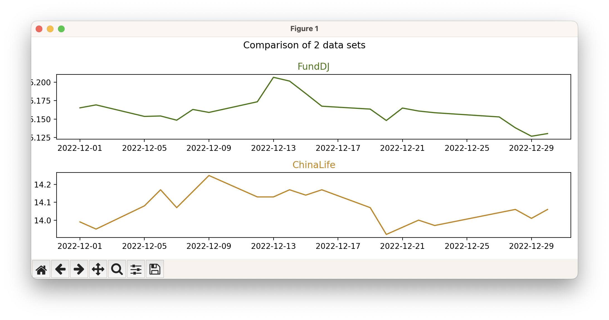

# MoneyDJ Reader
A Python 3 reader for MoneyDJ URLs/formats (.djbcd)

## Download the script
Downloaded the latest release as a zip file: 
- [main.zip](https://github.com/rdvansloten/moneydj-reader/archive/refs/heads/main.zip)

or use Git from the terminal:

```sh
git clone https://github.com/rdvansloten/moneydj-reader.git
```

## Edit the CSV file
First, add your data sources into moneydj.csv in the format `name, url`. 

Requirements:
- File must be in the `.djbcd` format
- Start and end dates are present in the URL 
- Comma between Name and URL in the CSV file

```csv
FundDJ, https://www.moneydj.com/funddj/bcd/tBCDNavList.djbcd?a=ACAI20&B=1970-01-01&C=1970-01-01&D=
ChinaLife, https://chinalife.moneydj.com/w/bcd/BCDFVNavList.djbcd?fid=TFPK&bDate=1970-01-01&eDate=1970-01-01
```

## Install the requirements
A few libraries are required to run this script. In your terminal, go to the folder where you've downloaded or unzipped this script, then execute the following:

```sh
pip3 install --no-cache-dir -r requirements.txt
```

or

```sh
pip install --no-cache-dir -r requirements.txt
```

## Run the script
Now, run the chart.py with python3:

### Create a plot
```sh
python3 chart.py --start-date 2022-12-01 --end-date 2023-01-01
```

### Save to PDF or PNG
```sh
python3 chart.py --start-date 2022-12-01 --end-date 2023-01-01 --output pdf
```

```sh
python3 chart.py --start-date 2022-12-01 --end-date 2023-01-01 --output png
```

A graph should now appear:

